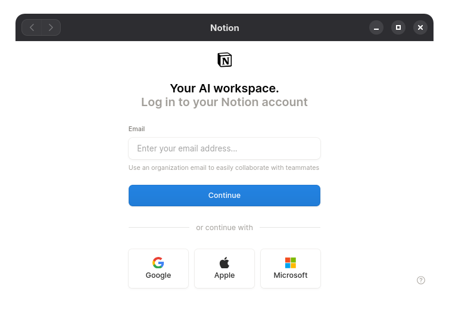

# Notion-Gnome
A Firefox-based Notion PWA styled to look like a GNOME GTK4 application.



This repo packages the Notion app launcher, an isolated Firefox profile, and custom Firefox chrome styles for `https://app.notion.com`.

## 📋 Features

- Isolated Firefox profile so your personal Firefox settings are not changed
- GNOME-style titlebar

## 💻 Requirements

- Firefox
- GNOME or another Linux desktop with `.desktop` support

## 🔨 Install

```bash
git clone https://github.com/Balazsmi/Notion-Gnome
cd Notion-Gnome
bash install.sh
```

Then launch **Notion** from your application menu.

## 🗑️ Uninstall

```bash
bash uninstall.sh
```
